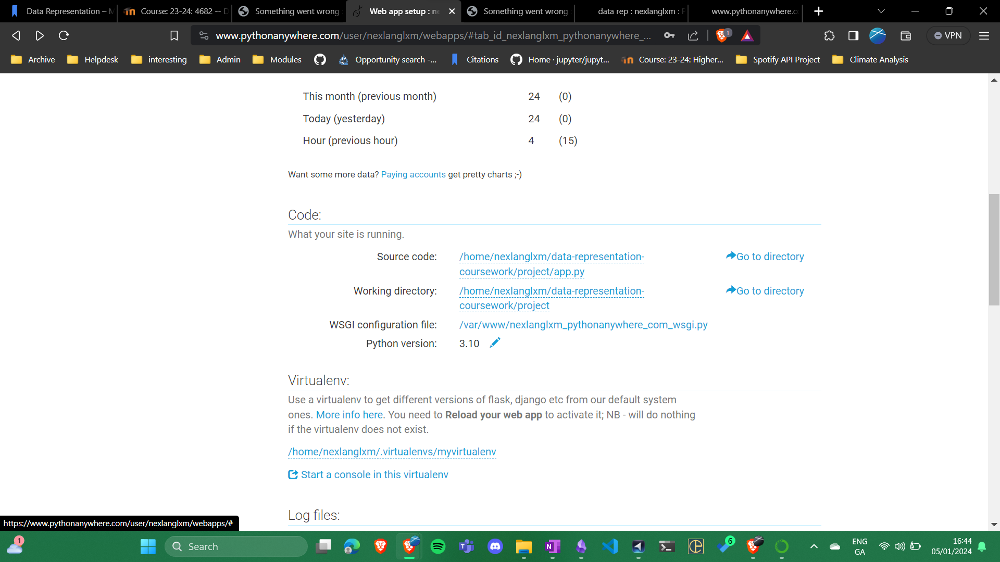

# Project: Spotify Personalized Playlist Generator

## **Project Brief:**

Write a project that demonstrates that you understand creating and consuming RESTful APIs.

## Project Assessment Strategy

Level 1: 40-45%

- Basic FLASK server
- REST API (to perform CRUD operations)
- One database table
- Accompanying web interface, using AJAX calls, to perform CRUD operations

Level 2: 45-50%

- More than one database table

Level 3: 50-55%

- Uses authorization

EXTRAS:

Web page looks nice.                        + 0-10%
More complicated API.                       + 0-10%
Server links to a third party API.          + 0-10%
Third party API requires authentication.    + 0-10%
Hosted online (Pythonanywhere, Azure)       + 10%

<https://nexlanglxm.pythonanywhere.com/>



## **Description**

The SPG is a web application designed to create personalized playlists for users based on their music preferences. This project aims to provide an interactive platform where userscan input their favorite artists, genres, or songs, and the application interacts with the Spotify API to generate customized playlists.

## **Objective**

## **Features and Functionality:**

- User Input: Users can input their favorite artists, genres, or songs through an intuitive, user-friendly web interface.
- Spotify API Integration: Interaction with the Spotify API to retrieve music data based on user preferences.
- Playlist Generation: Utilizing the gathered preferences, the application creates personalized playlists for users.
- Potential Integration with Genius API: Planned integration with the Genius API for additional song lyrics information (future expansion).

## **Technology Stack:**

- Python for backend development.
- Flask for creating the RESTful API.
- Spotify API for music data.
- (Potentially) Genius API for song lyrics.

## **Development Steps:**

- Set up the folder environment.
- Develop this READme.md file.
- Set up Flask environment.
- Implement user input functionality.
- Integrate Spotify API for playlist creation.
- Implement user authentication.
- (Later stage) Integrate Genius API for song lyrics.

## **Folder Structure:**

- Separate folders for frontend, backend, API files, etc.
- The whole project is contained in a `project` folder.
- The `static` folder contains a `stylesheet.css` file,
- The `templates` folder contains the index html file, which will be displayed to the user.
- The `routes` folder contains all the different python files which interact with the API,

## **Installation and Usage:**

### Prerequisites

- Python 3.11.4
- pip package manager

### Installation Steps

1.Clone the repository:

```bash
git clone https://github.com/nexlanglxm/data-representation-coursework.git
cd project
```

2.Set up a virtual environment (recommended):

```bash
python -m venv venv
venv\Scripts\activate
```

3.Install required dependencies:

```bash
pip install -r requirements.txt
```

### Configuration

1. Obtain Spotify API credentials from the Spotify Developer Dashboard.
2. Update auth.py with your Spotify API client ID and client secret.

### Running the Application

Start the Flask server:

```bash
python app.py
```

Access the application in your web browser:

```arduino
http://127.0.0.1:5000
```

### Usage

Upon accessing the application, navigate to the specified endpoints to perform actions:

- /login: Initiate Spotify authentication.
- /generate_playlist: Create playlists based on user input.
- /get_user_profile: Retrieve user's Spotify profile.

## **References and Resources:**

developer.spotify.com. (n.d.). Authorization Code with PKCE Flow | [Spotify Developer Tools](https://developer.spotify.com/)). [online] Available at: https://developer.spotify.com/documentation/web-api/tutorials/code-pkce-flow.

docs.python.org. (n.d.). base64 — Base16, Base32, Base64, Base85 Data Encodings — Python 3.9.5 documentation. [online] Available at: https://docs.python.org/3/library/base64.html.

Pallets (n.d.). Static Files — [Flask documentation](https://github.com/pallets/flask/blob/3.0.x/docs/tutorial/static.rst) (3.0.x). [online] Github.com. Available at: https://github.com/pallets/flask/blob/3.0.x/docs/tutorial/static.rst [Accessed 22 Nov. 2023].

PyPI. (n.d.). pkce: PKCE Python generator. [online] Available at: https://pypi.org/project/pkce/ [Accessed 14 Dec. 2023].

Python.org. (2015). secrets — Generate secure random numbers for managing secrets — Python 3.7.1 documentation. [online] Available at: https://docs.python.org/3/library/secrets.html.

- Spotify [API documentation](https://any-api.com/spotify_com/spotify_com/docs/API_Description)

Future works:
- Genius [API documentation](https://rapidapi.com/Glavier/api/genius-song-lyrics1/).
